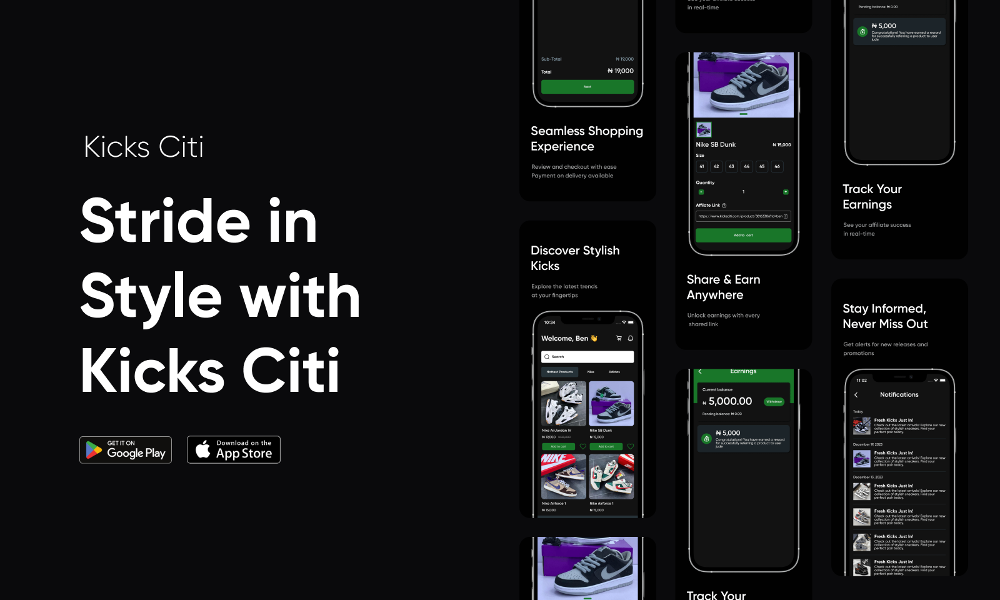

# 🎊🎊 Kicks Citi V2 🎊🎊

## Edit: The New Version is Currently Live

You can download new the application [here](https://www.kicksciti.com)

## 🔊🔊 Important Announcement: Project Rewrite

Hello Everyone,

I hope this message finds you well. We wanted to take a moment to share some exciting news about the future of our project. Kicks Citi is getting a rewrite!

### Why the Change?

Kicks Citi being my first react native project, had alot of problems. I've decided to embark on a significant overhaul of this project. This decision stems from my commitment to providing a more robust, maintainable, and scalable application that can better meet the evolving needs of our users.

### Background:

This project was initially my first venture into React Native development. As I've gained experience and insights, I've recognized opportunities for improvement. To ensure I deliver the best possible app, I've made the decision to start afresh and apply the lessons learned through out my years to building a worthy project.

### What's Changing?

#### Code Changes:

- **Transition to TypeScript (TS):** We're migrating from JavaScript (JS) to TypeScript (TS) for a more efficient and safer development experience.
- **Backend Migration:** Transitioning from Firebase to AWS for improved scalability, performance, and flexibility in managing our backend infrastructure.
- **Email Marketing Integration:** Implementing email marketing to keep you informed about exciting updates, promotions, and relevant content.
- **Push Notifications:** Enhancing user engagement with the introduction of push notifications, ensuring you stay connected with the latest app activities.

#### App Changes:

- **Design Overhaul:** We are refreshing the app's design to provide a more modern, intuitive, and visually appealing experience.
- **User-to-User Marketplace:** Introducing a new feature that allows users to post shoes for sale on our platform, fostering a dynamic marketplace within the app.
- **Pay on Delivery:** A new payment option has been added, allowing users to pay for their purchases upon delivery.
- **Affiliate Program:** Users can now leverage affiliate links for all products, giving them an opportunity to earn money through the platform.
- **Revamped Sign-Up Flow:** The sign-up process is being redesigned for a smoother and more user-friendly onboarding experience.

and many more...

### Find the Old Project Code:

If you're interested in the code of the old project, you can find it in the "v1" branch of this repository.~~

### Note on Current Version:

~~The current version available on the Play Store is based on the old app. We will continue to support this version until the new and improved app is ready for release.~~

Edit: 🎊🎊The new version is currently complete and live on Play Store and Apple Appstore🎊🎊.

You can download new the application [here](https://www.kicksciti.com)

### Get Involved!

We encourage you to stay engaged with the project during this exciting phase. You can:

- **Follow our Progress:** We'll be providing regular updates on our progress. Stay tuned to this repo for the latest info.
- **Contribute:** If you're passionate about the project and TypeScript, we welcome contributions from the community. You can reach out to me through any of my social media handles or via email - inbox@benjamineruvieru.com

### Thank You

We want to express our gratitude to the Kicks Citi community for your ongoing support. This rewrite represents a significant milestone in the evolution of our app, and we're thrilled to have you with us on this journey.

Thank you for being a part of the Kicks Citi family.

Best regards,
Benjamin
