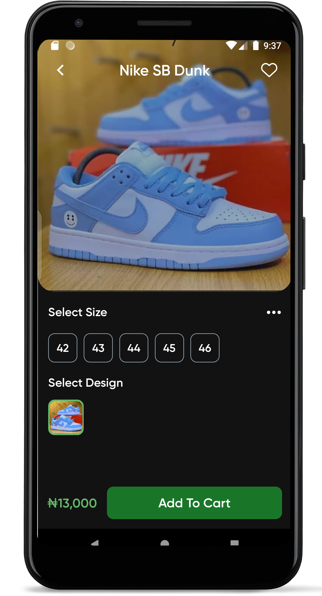
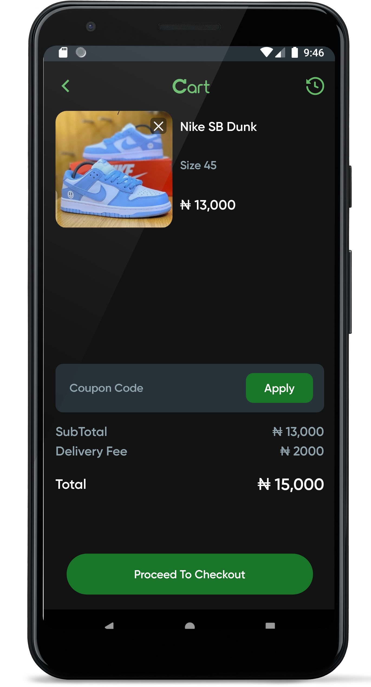
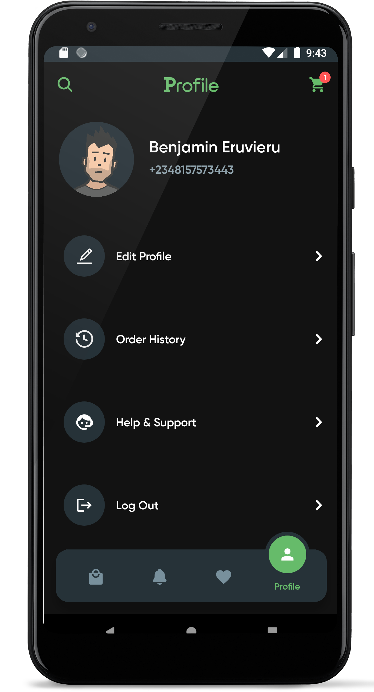

# Kicks Citi

### An E-Commerce store for Shoe Enthusiasts.


Kicks Citi is designed to be a one-stop destination for individuals who are passionate about footwear. Whether you're a sneakerhead, a fashion-forward trendsetter, or someone simply in need of comfortable and stylish shoes, Kicks Citi has got you covered

## Features

- Add products to cart or favorites
- Search through a collection of products
- Complete payments of orders In-App
- Track the progress of your orders
- Contact help & support staff

## Tech Used

- React Native
- Firebase
- Flutterwave for handling payments
- Cloud Functions
- Redux
- Axios
- Sirv - Image Hosting

[](https://play.google.com/store/apps/details?id=com.kicksciti.android)

## How to build

Clone this repo to your machine:

```
$ git clone https://github.com/benjamineruvieru/kicksciti.git
```

```
$ cd kicksciti
```

Install dependencies:

```
$ npm install
```

If you are running app on iOS:

```
$ cd ios
```

```
$ pod install
```

Return to the project main directory:

```
$ cd ..
```

To run on android:

```
$ react-native run-android
```

To run on iOS:

```
$ react-native run-ios
```

On Android if you are getting this error<br />

Error: spawn ./gradlew EACCES<br />

To fix:

```
$ cd android
```

```
$ chmod u+x gradlew
```

Then try running the project again

<p float="left">






</p>

## Contributing

1.  Create a fork
2.  Create your feature branch: `git checkout -b my-feature`
3.  Commit your changes: `git commit -am 'Add some feature'`
4.  Push to the branch: `git push origin my-new-feature`
5.  Submit a pull request 🚀
    <br />

Built by @benjamineruvieru
